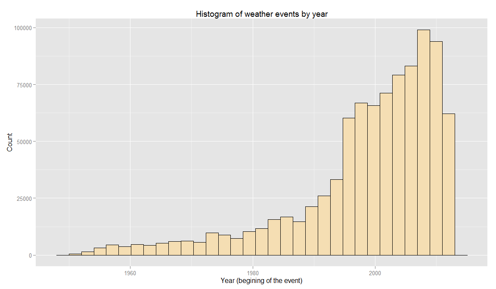
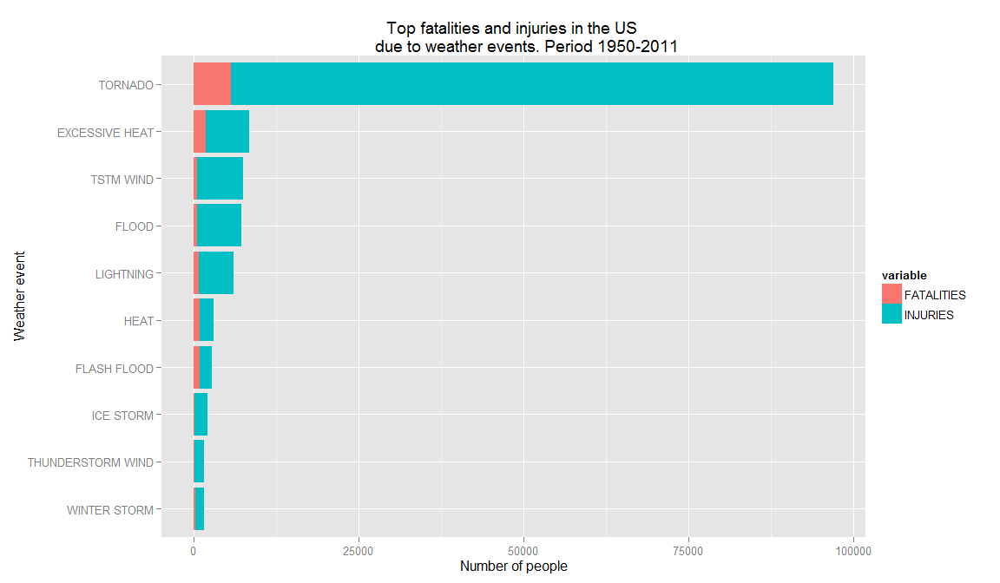
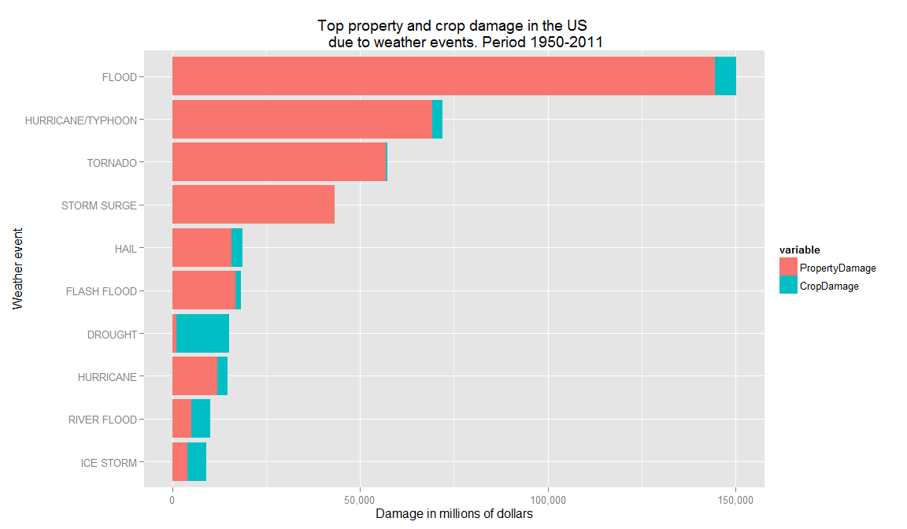

# Analysis of impact of weather events on public health and economic damage in the US
Jieqian Liu  
August 8th, 2021  


## Synopsis

This analysis explores the U.S. National Oceanic and Atmospheric Administration's (NOAA) storm database, which describes the features of major weather events from 1950 to 2011. The current report focuses on damage to the public health (injuries and fatalities) and to the economy of the affected communities. In order to accomplish the goal, a normalization of the storm database is needed given the timespan of included events. A simple approach is taken for other features of the database that requires cleansing, like the way economic damages are expressed in the data.

The analysis confirmed that the information of most recent events have better quality in the database, last years are more complete. By far the most harmful events are tornadoes in terms of public health, and floods regarding damage to the economy.


## Data processing

### Dependencies

The following code is used to load the dependencies required for the data analysis.


```r
# Load libraries
library(R.utils)
library(data.table)
library(dplyr)
library(ggplot2)
library(stringr)
library(lubridate)
library(reshape2)
library(scales)
```


### Load the dataset

The data is downloaded from the internet and loaded into the environment.


```r
urlStormData <- 
    "https://d396qusza40orc.cloudfront.net/repdata%2Fdata%2FStormData.csv.bz2"

# Create directory data if needed
if(!file.exists("./data")) {
    dir.create("./data")
}

# Download the compressed file if needed
if(!file.exists("./data/repdata-data-StormData.csv.bz2")) {
    download.file(fileUrl, 
                  "./data/repdata-data-StormData.csv.bz2", 
                  mode = "wb") # mode "wb" for binary files
}

# Extract the file if needed
if(!file.exists("./data/repdata-data-StormData.csv")) {
    bunzip2("./data/repdata-data-StormData.csv.bz2")
}

# Load the CSV
stormData <- fread("./data/repdata-data-StormData.csv")
```

```
## 
Read 0.0% of 967216 rows
Read 21.7% of 967216 rows
Read 33.1% of 967216 rows
Read 45.5% of 967216 rows
Read 54.8% of 967216 rows
Read 68.2% of 967216 rows
Read 78.6% of 967216 rows
Read 85.8% of 967216 rows
Read 902297 rows and 37 (of 37) columns from 0.523 GB file in 00:00:18
```


### Normalize the event types

The type of each weather event is stored in the column `EVTYPE` of the dataset.

In order to improve the analysis quality the event types reported needs to be normalized.

For certain events, the information about the event type is sometimes mixing upper and lower cases, or having whitespaces at the begining. For a better process the following code fix the mentioned problems.


```r
# Remove whitespaces at the begining and the end of the event type
stormData$EVTYPE <- str_trim(stormData$EVTYPE)

# Put all the event types in upper case
stormData$EVTYPE <- toupper(stormData$EVTYPE)
```


### Subset columns relevant to the analysis

For the purpose of the current report, the only information needed is the one regarding the type of each weather event in the database, the number of fatalities and injuries, and the estimated property and crop damages. 

In context, the columns needed for the process are:

* `EVTYPE`: Event type
* `FATALITIES`: Number of fatalities
* `INJURIES`: Number of injuries
* `PROPDMG`: Property damage (numeric value)
* `PROPDMGEXP`: Property damage (exponential indicator affecting the numeric value)
* `CROPDMG`: Crop damage (numeric value)
* `CROPDMGEXP`: Crop damage (exponential indicator affecting the numeric value)


```r
stormDataValues <- select(stormData, EVTYPE, 
                          FATALITIES, INJURIES,
                          PROPDMG, PROPDMGEXP,
                          CROPDMG, CROPDMGEXP)
```


### Analyze and normalize the values expressed for economic damage

In the dataset, the values of property and crop damage estimates are expressed by using 2 columns, one for a numeric value and the other for an exponential indicator. This exponent multiplies the given numeric value by a factor.


For property damage, for all the cases where a numeric value is reported, the exponential raw indicators and its frequencies `n` are:


```r
kable(
    arrange(
        count(stormDataValues[(stormDataValues$PROPDMG > 0), ], PROPDMGEXP), -n),
    format = "markdown")
```


|PROPDMGEXP |      n|
|:----------|------:|
|K          | 227481|
|M          |  11319|
|0          |    209|
|           |     76|
|B          |     40|
|5          |     18|
|m          |      7|
|H          |      6|
|+          |      5|
|4          |      4|
|6          |      3|
|7          |      2|
|h          |      1|
|2          |      1|
|3          |      1|
|-          |      1|

*Table 1. Exponential indicators of property damage ordered by frequency of occurrence when a numeric value is reported (greater than 0).*


For crop damage, for all the cases where a numeric value is reported, the exponential raw indicators and its frequencies `n` are:


```r
kable(
    arrange(
        count(stormDataValues[(stormDataValues$CROPDMG > 0), ], CROPDMGEXP), -n),
    format = "markdown")
```


|CROPDMGEXP |     n|
|:----------|-----:|
|K          | 20137|
|M          |  1918|
|k          |    21|
|0          |    12|
|B          |     7|
|           |     3|
|m          |     1|

*Table 2. Exponential indicators of crop damage ordered by frequency of occurrence when a numeric value is reported (greater than 0).*


By analyzing the different cases in the dataset and supported by the [NWS Instruction 10-1605](https://d396qusza40orc.cloudfront.net/repdata%2Fpeer2_doc%2Fpd01016005curr.pdf) *(Appendix B - Property Damage Estimates)* we found the meaning of most of the exponential raw indicators. The table below explains the description of each indicator and the Reference number (`REFNUM`) of the events in the database that were inspected to understand the meaning.

Exp. indicator    | Description                       | Ref.events (column `REFNUM`)
------------------|-----------------------------------|-----------------------------
blank             | Multiplier by `1,000`             | `196687`, `196961`, `199598`
K                 | Multiplier by `1,000`             |
h/H               | Multiplier by `1,000`             | `209259`, `232385`, `247970`, `247989`
m/M               | Multiplier by `1,000,000`         |
B                 | Multiplier by `1,000,000,000`     |
1, 2, ..., 8      | Multiplier by `10^1`, `10^2`, etc |
0                 | Unclear                           | `189004`, `245807`, `193313`, `193314`
+                 | Unclear                           |
-                 | Unclear                           | `229314` 

*Table 3. Results from exploratory analysis of exponential indicators of property and crop damage.*

Note that the exponential indicators registered as `h` and `H` are semantically close to the concept of "hundreds", but after analysis of the events concerned we arrived to the conclusion that the values reported are factors of thousands instead. The same exploration was done for some events with the indicators registered as blank and the conclusion was the same.

For the cases marked as "Unclear" there is no enough information to apply a factor to the numeric values of economic damages. Therefore, no transformation can be done to the values in those events during the current report (the numeric value is taken as is), pending further investigations for future versions of the analysis.


#### Normalize property damage values

A new column `PropertyDamage` is added to the work dataset for the normalized value in property damage estimated, expressed in US dollars.


```r
# Initialize new column with the value of the original one
stormDataValues$PropertyDamage <- stormDataValues$PROPDMG

# Process K/h/H/blank cases (multiplier by 1,000):
stormDataValues[PROPDMGEXP == "h"]$PROPDMGEXP <- "K"
stormDataValues[PROPDMGEXP == "H"]$PROPDMGEXP <- "K"
stormDataValues[PROPDMGEXP == ""]$PROPDMGEXP <- "K"
stormDataValues[PROPDMGEXP == "K"]$PropertyDamage <- 
    stormDataValues[PROPDMGEXP == "K"]$PROPDMG * 1000

# Process m/M (multiplier by 1,000,000):
stormDataValues[PROPDMGEXP == "m"]$PROPDMGEXP <- "M"
stormDataValues[PROPDMGEXP == "M"]$PropertyDamage <- 
    stormDataValues[PROPDMGEXP == "M"]$PROPDMG * 1000000

# Process B (multiplier by 1,000,000,000):
stormDataValues[PROPDMGEXP == "B"]$PropertyDamage <- 
    stormDataValues[PROPDMGEXP == "B"]$PROPDMG * 1000000000

# Process 1/2/.../8 (multiplier by 10 ~ ^ exponential indicator)
stormDataValues[
    PROPDMGEXP %in% c("1", "2", "3", "4", "5", "6", "7", "8")]$PropertyDamage <- 
    stormDataValues[
        PROPDMGEXP %in% c("1", "2", "3", "4", "5", "6", "7", "8")]$PROPDMG * 10 ^ as.numeric(stormDataValues[
        PROPDMGEXP %in% c("1", "2", "3", "4", "5", "6", "7", "8")]$PROPDMGEXP)
```


#### Normalize crop damage values

A new column `CropDamage` is added to the work dataset for the normalized value in crop damage estimated, expressed in US dollars.


```r
# Initialize new column with the value of the original one
stormDataValues$CropDamage <- stormDataValues$CROPDMG

# Process k/K (multiplier by 1,000):
stormDataValues[CROPDMGEXP == "k"]$CROPDMGEXP <- "K"
stormDataValues[CROPDMGEXP == "K"]$CropDamage <- 
    stormDataValues[CROPDMGEXP == "K"]$CROPDMG * 1000

# Process m/M (multiplier by 1,000,000):
stormDataValues[CROPDMGEXP == "m"]$CROPDMGEXP <- "M"
stormDataValues[CROPDMGEXP == "M"]$CropDamage <- 
    stormDataValues[CROPDMGEXP == "M"]$CROPDMG * 1000000

# Process B (multiplier by 1,000,000,000):
stormDataValues[CROPDMGEXP == "B"]$CropDamage <- 
    stormDataValues[CROPDMGEXP == "B"]$CROPDMG * 1000000000
```


### Aggregate by damage kind

An aggregation strategy is devised to stablish a ranking for the two groups of informations: damage to the public health and to the economy.

The new column `PeopleHarmed` is the sum of the `FATALITIES` and `INJURIES` columns.

The new column `EconomicDamage` is the sum of the `CropDamage` and `PropertyDamage` columns.


```r
# New column with the sum of fatalities and injuries 
stormDataValues$PeopleHarmed <- 
    stormDataValues$FATALITIES + stormDataValues$INJURIES

# New column with the sum of property and crop damage
stormDataValues$EconomicDamage <- 
    stormDataValues$CropDamage + stormDataValues$PropertyDamage
```


### Analyzing the quantiles

The target is to look how the data is grouped after the processing. In order to achieve that, the quantiles of the columns related to the present report are computed.


```r
# Damage to the public health
quantile(stormDataValues$PeopleHarmed)
```

```
##   0%  25%  50%  75% 100% 
##    0    0    0    0 1742
```

```r
# Economic damage
quantile(stormDataValues$EconomicDamage)
```

```
##           0%          25%          50%          75%         100% 
##            0            0            0         1000 115032500000
```

For both cases, most of the useful data to address the analysis are located between the `75%` and `100%` groups.


### Filtering data at the top of the ranking

After analyzing the quantiles, two separated datasets are created with the data at the top of the ranking for each damage kind.


```r
# Damage to the public health: Last quantile
healthDamage <- subset(stormDataValues, 
                       PeopleHarmed > 0, 
                       c(EVTYPE, FATALITIES, INJURIES, PeopleHarmed))

# Economic damage: Last quantile
economicDamage <- subset(stormDataValues, 
                         EconomicDamage > 1000,
                         c(EVTYPE, PropertyDamage, CropDamage, EconomicDamage))
```


### Summarize data by event type

The final data is grouped by event type and the sum is computed for each damage kind. The two datasets are arranged in descending order of the corresponding numerical value, and only the top 10 event types are taken to present the results. Finally, the data is reorganized in a format suitable for plotting.


```r
# Damage to public health by event type
groupHealthByEventType <- group_by(healthDamage, EVTYPE) 

# Summarize
healthByEventType <- summarise_each(groupHealthByEventType, funs(sum))

# Order the data. Most harmful event types at the top
healthByEventType <- arrange(healthByEventType, -PeopleHarmed)

# Filter only the top 10 events
topHealthByEventType <- slice(healthByEventType, 1:10)

# Order the factors for the plot
topHealthByEventType$EVTYPE <- 
    factor(topHealthByEventType$EVTYPE, 
           levels = rev(topHealthByEventType$EVTYPE))

# Organize the dataset for the plot
topHealthByEventType <- 
    melt(subset(topHealthByEventType, select = -PeopleHarmed), 
         id.vars = "EVTYPE")


# Economic damage by event type
groupEconomicByEventType <- group_by(economicDamage, EVTYPE) 

# Summarize
economicByEventType <- summarise_each(groupEconomicByEventType, funs(sum))

# Order the data. Most harmful event types at the top
economicByEventType <- arrange(economicByEventType, -EconomicDamage)

# Filter only the top 10 events
topEconomicByEventType <- slice(economicByEventType, 1:10)

# Order the factors for the plot
topEconomicByEventType$EVTYPE <- 
    factor(topEconomicByEventType$EVTYPE, 
           levels = rev(topEconomicByEventType$EVTYPE))

# Organize the dataset for the plot
topEconomicByEventType <- 
    melt(subset(topEconomicByEventType, select = -EconomicDamage), 
         id.vars = "EVTYPE")
```


## Results

### Histogram of events by year

As mentioned by NOAA, the events reported are more complete in recent years.


```r
qplot(x = year(mdy_hms(BGN_DATE)),
      data = stormData,
      main = "Histogram of weather events by year",
      xlab = "Year (begining of the event)",
      ylab = "Count",
      fill = I("wheat"),
      col = I("black"))
```

 
*Figure 1. Histogram showing the frequency of all the weather events by year as reported on the NOAA's storm database.*


### Most harmful event types

#### Damage to the public health


```r
qplot(EVTYPE, value, 
      data = topHealthByEventType, 
      geom = "bar",
      fill = variable,
      stat = "identity",
      main = "Top fatalities and injuries in the US 
      due to weather events. Period 1950-2011",
      ylab = "Number of people",
      xlab = "Weather event") + 
    coord_flip()
```

 
*Figure 2. Top 10 event types regarding damage to the public health, decomposed by injuries and fatalities.*

The most harmful events to public health are TORNADO followed by EXCESSIVE HEAT and TSTM WIND.


#### Economic damage


```r
qplot(EVTYPE, value / 1000000, 
      data = topEconomicByEventType, 
      geom = "bar",
      fill = variable,
      stat = "identity",
      main = "Top property and crop damage in the US 
      due to weather events. Period 1950-2011",
      ylab = "Damage in millions of dollars",
      xlab = "Weather event") + 
    coord_flip() +
    scale_y_continuous(labels = comma)
```

 
*Figure 3. Top 10 event types regarding economic damage, decomposed by property and crop damage.*

The most harmful events to the economy are FLOOD, followed by HURRICANE/TYPHOON and TORNADO.
